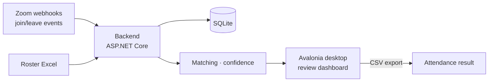

# ZoomCheck

> Zoom attendance dashboard for classes and training sessions (Windows-oriented)

[한국어](README.md) · [MIT License](LICENSE) · .NET 8 · Avalonia · 

ZoomCheck loads a roster from Excel, takes Zoom join/leave events, and matches
participants against the roster to compute attendance. In a real class where names,
nicknames, and device names are mixed, checking every attendee by hand isn't practical.

**ZoomCheck handles confident matches automatically and sends only the ambiguous ones
to a review queue.** The operator ignores most attendees and focuses on the few that
need review.

## Architecture



## Quick start (installer)

1. Run `ZoomCheck-Setup-x64.exe` and finish the wizard
2. Launch the **ZoomCheck** shortcut (the local service starts automatically)
3. Open/join the Zoom meeting
4. Enter the meeting ID → load the roster → refresh during class → review flagged people → export at the end

Installer assets live under `deploy/windows/`.

## Layout

Split into four projects.

| Project | Responsibility |
|---|---|
| `src/ZoomCheck.Core` | Domain models and matching logic |
| `src/ZoomCheck.Infrastructure` | Excel parsing and SQLite persistence |
| `src/ZoomCheck.Backend` | Roster import, Zoom webhooks, board projection, export API |
| `src/ZoomCheck.App` | Operator dashboard (Avalonia desktop) |

## Match confidence

| Level | Meaning |
|---|---|
| `Verified` | Strongest match, usually email-based |
| `AliasVerified` | Operator confirmed this Zoom name before |
| `NameOnly` | Name matches, but a quick check is recommended |
| `Possible` | Weak candidate, review recommended |
| `Unmatched` | No safe roster match |

## API

Run from source, the backend listens on `http://0.0.0.0:5078` and the desktop app
targets `http://127.0.0.1:5078/`.

| Endpoint | Description |
|---|---|
| `GET /health`, `GET /api/zoom/settings-status` | Health and configuration |
| `POST /api/roster/import`, `GET /api/roster`, `POST /api/roster/alias` | Roster |
| `POST /api/zoom/webhooks/events` · `participant-event` · `raw` | Zoom events |
| `GET /api/zoom/recovery/last`, `POST /api/zoom/recovery/run` | Late-start recovery |
| `GET /api/meetings/{meetingId}/board` | Live board |
| `POST /api/meetings/{meetingId}/seed-demo` | Seed demo events |
| `GET /api/meetings/{meetingId}/export` | Export attendance CSV |

## Configuration reference

Set values in `src/ZoomCheck.Backend/appsettings.json` or via environment variables.

```json
"Zoom": {
  "WebhookSecretToken": "...",
  "ClientId": "...",
  "ClientSecret": "...",
  "AccountId": "...",
  "RequestTimestampToleranceSeconds": 300
}
```

These enable webhook signature validation, `endpoint.url_validation` challenge handling,
S2S OAuth token acquisition and caching, and status checks via `/api/zoom/settings-status`.

Data is stored in SQLite (default `data/zoomcheck.db`): roster entries, alias mappings,
and participant event logs.

## Late-start recovery

If the backend starts after a meeting has begun, Zoom does not resend earlier
participant events. A recovery path fills that gap.

- Configure `ZoomRecovery` in `appsettings.json`: `Enabled`, `StartupDelaySeconds`,
  `PeriodicScanIntervalSeconds` (`0` disables periodic scans), `HostUserIds`,
  `EnableAccountWideUserDiscovery`, `IncludeFallbackMeUser`, and more.
- It discovers live meetings via Zoom `GET /users/{userId}/meetings?type=live`, then
  inserts missing `joined` events with `source = zoom-live-recovery` from
  `GET /metrics/meetings/{meetingId}/participants?type=live`.
- `POST /api/zoom/recovery/run` runs it on demand; `GET /api/zoom/recovery/last` returns
  the last run summary.

## Known limitations

- The desktop UI uses **manual Refresh**, not auto-refresh or push. The backend is
  event-driven, but the screen is not.
- Real post-meeting Zoom reconciliation is not implemented yet.
- Installer generation is prepared, but the final `setup.exe` should be built on Windows.

## Development

Run from source:

```bash
dotnet run --project src/ZoomCheck.Backend/ZoomCheck.Backend.csproj --urls http://0.0.0.0:5078
dotnet run --project src/ZoomCheck.App/ZoomCheck.App.csproj
```

Build the Windows installer (.NET 8 SDK + Inno Setup 6):

```powershell
powershell -ExecutionPolicy Bypass -File .\deploy\windows\build-installer.ps1
```

Output: `dist\installer\ZoomCheck-Setup-x64.exe`. It can also be built via GitHub
Actions `.github/workflows/build-windows-installer.yml`. Operator guide:
`docs/windows-operator-guide.md`.

## License

[MIT](LICENSE) © 2026 AhnRyu
