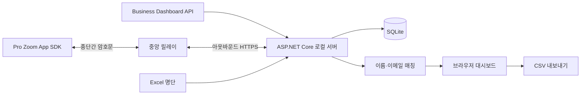

# ZoomCheck

Windows에서 Excel 명단과 진행 중인 Zoom 회의 참가자를 공식 Zoom API로 대조하는 로컬 웹 대시보드입니다. Business용 Dashboard API와 Pro에서도 사용할 수 있는 회의 내 Zoom App 연결을 함께 지원합니다.

[English](README.md) · [Windows 실회의 테스트](docs/windows-live-test-ko.md) · [MIT License](LICENSE)

[](https://github.com/ianlyoo/zoomcheck/actions/workflows/ci.yml)
[](https://github.com/ianlyoo/zoomcheck/actions/workflows/build-windows-installer.yml)
[](https://github.com/ianlyoo/zoomcheck/releases/latest)

Zoom 참가자 패널을 화면 인식하거나 UI Automation으로 읽지 않습니다. Business 계정은 공식 Zoom Dashboard API를 조회하고, Pro 경로는 호스트·공동호스트가 회의 안에서 연 Zoom App SDK의 참가자 목록을 사용합니다.

## 주요 기능

- 브라우저에서 Excel `.xlsx`/`.xls` 직접 업로드
- Excel의 `조`·`분반`·`그룹`·`팀`·`반` 열을 읽어 선택한 조만 집계·검색·CSV 내보내기
- Zoom 현재 참가자 즉시 조회 및 5~600초 자동 동기화
- 이메일 우선 매칭, 이름·별칭 매칭, 검토 필요/미매칭 분리
- SQLite 기반 입장·퇴장 액티브 로그와 현재 참석 상태
- 참가자 행 클릭 상세: 현재 연결, 원래 Zoom 이름, 전화번호, 조, 자동 정리 이름, 입·퇴장 이력
- 동일 명단 인물의 중복 접속 그룹과 이름 변경 활동 기록
- 명단에서 유일하게 확인되는 영인 유 → 유영인 형태만 안전하게 자동 정리
- 호스트·공동호스트가 확인 버튼을 눌렀을 때만 안전하게 확정된 이름을 실제 Zoom 회의에 적용
- CSV 내보내기와 API 장애 시 전체 참가자 목록 수동 붙여넣기
- 별도 .NET 설치가 필요 없는 Windows 설치 파일과 portable ZIP
- 시작 시 새 버전 자동 확인·다운로드와 대시보드에서 한 번 눌러 설치·재시작
- 처음 설치한 사용자를 위한 6단계 시작 안내, 건너뛰기, 언제든 다시 보기
- Windows 설정 연동과 사용자 선택 저장을 지원하는 밝은 모드·다크 모드
- `http://127.0.0.1:5078`에만 바인딩되는 로컬 웹 대시보드
- `자동 / Business API / Zoom 앱(Pro) / 직접 입력` 연결 모드

## 연결 방식 A: Business 이상 Dashboard API

공동호스트 권한만으로는 API 권한이 생기지 않습니다. 회의가 속한 Zoom 계정의 소유자/관리자가 Zoom Marketplace에서 Server-to-Server OAuth 앱을 만들고 활성화해야 합니다.

- 최신 granular scope: `dashboard:read:list_meeting_participants:admin`
- 기존 classic scope: `dashboard_meetings:read:admin`
- Zoom Dashboard API 접근이 포함된 계정 권한도 필요합니다. 실제 권한이 부족하면 대시보드가 403 원인을 표시합니다.

Windows PowerShell에서 자격증명을 현재 사용자 환경 변수로 한 번 저장한 뒤 ZoomCheck를 완전히 종료하고 다시 실행합니다.

```powershell
[Environment]::SetEnvironmentVariable("ZOOMCHECK_Zoom__AccountId", "여기에_ACCOUNT_ID", "User")
[Environment]::SetEnvironmentVariable("ZOOMCHECK_Zoom__ClientId", "여기에_CLIENT_ID", "User")
[Environment]::SetEnvironmentVariable("ZOOMCHECK_Zoom__ClientSecret", "여기에_CLIENT_SECRET", "User")
```

이 값은 GitHub, ZIP, `appsettings.json`에 넣지 마세요. 설치 파일과 portable ZIP은 OAuth 값, DB, Excel, CSV, 로그를 포함하지 않도록 빌드 단계에서 검사합니다.

## 연결 방식 B: Pro Zoom App

공동호스트 개인 계정의 요금제를 추정하지 않습니다. 회의 안에서 Zoom App을 실행한 사용자의 실제 역할과 `getMeetingParticipants` 지원 여부를 런타임에 확인합니다. 호스트 또는 공동호스트이고 SDK 권한이 열려 있으면 Pro 경로를 사용할 수 있습니다.

### 앱 관리자: 최초 1회

1. 이 저장소를 fork한 뒤 `render.yaml` Blueprint로 **본인 소유 Render 계정**에 릴레이를 배포하거나, `src/ZoomCheck.Relay`를 본인이 관리하는 HTTPS 서버에 배포합니다. 이 공개 저장소와 GitHub Release에는 특정 개인의 릴레이 주소가 포함되지 않습니다. 일반 사용자 PC를 공개 HTTPS로 노출하지 않습니다. 릴레이는 암호문·공개키·짧은 수명의 세션만 메모리에 보관하고 참가자 정보를 복호화할 수 없습니다.
2. Zoom Marketplace에서 User-managed General App을 만들고 Meetings 제품과 Zoom App SDK를 켭니다.
3. SDK API·이벤트는 `getSupportedJsApis`, `getMeetingContext`, `getMeetingUUID`, `getUserContext`, `getMeetingParticipants`, `onParticipantChange`, `setParticipantScreenName`을 추가합니다. Guest Mode는 참가자 목록 API를 지원하지 않으므로 켜지 않습니다. `setParticipantScreenName`을 허용하지 않으면 출석 동기화는 작동하지만 실제 회의 이름 변경 버튼은 사용할 수 없습니다.
4. Home URL과 OAuth Redirect/Allow List에는 `https://YOUR-RELAY/zoom-app/`, Domain Allow List에는 `YOUR-RELAY`를 등록합니다.
5. 릴레이를 사용하는 각 Windows PC에 본인이 배포한 주소를 사용자 환경 변수로 설정하고 ZoomCheck를 다시 시작합니다. 공개 설치파일의 `ZoomRelay.BaseUrl`은 의도적으로 비어 있습니다.

```powershell
[Environment]::SetEnvironmentVariable("ZOOMCHECK_ZoomRelay__BaseUrl", "https://YOUR-RELAY/", "User")
```

팀 내부 전용 설치파일을 별도로 빌드하려면 `build-installer.ps1 -RelayBaseUrl https://YOUR-RELAY/`를 사용할 수 있지만, 그 결과물에는 해당 주소가 들어가므로 공개 GitHub Release에 올리지 마세요. Zoom Client Secret은 릴레이나 설치파일에 넣지 않습니다.

6. 컴패니언을 실행할 계정이 앱을 설치할 수 있게 Development Local Test 또는 조직 내부 배포를 허용합니다. 다른 Zoom 조직의 계정은 비공개 개발 앱을 바로 설치하지 못할 수 있으며, 이 경우 테스트 사용자 허용 또는 Marketplace 배포가 필요합니다.

### 호스트 계정: 최초 1회와 매 회의

- Zoom 웹 설정에서 공동 호스트 기능을 활성화합니다. 호스트가 컴패니언을 직접 열지 않는다면 ZoomCheck 앱 설치는 필요 없습니다.
- 회의를 평소처럼 시작하고, 운영 계정이 입장하면 **앱을 열기 전에** 공동호스트로 지정합니다. 앱을 먼저 열었다면 공동호스트 지정 후 앱 패널을 닫고 다시 여세요.

### 공동호스트 계정: 최초 1회와 매 회의

- 최초 1회: 최신 Zoom Workplace 데스크톱에 로그인하고 ZoomCheck 앱을 설치·승인합니다. 조직 계정은 관리자 사전 승인이 필요할 수 있습니다.
- 매 회의: 공동호스트 지정 확인 → Windows ZoomCheck 실행 → Excel 업로드 → 연결 모드 `자동` → 새 6자리 코드 생성 → Zoom의 **Apps → ZoomCheck**에서 코드 입력 순서로 연결합니다.
- 앱 패널을 닫거나 새로고침하면 메모리의 세션이 사라질 수 있으므로 새 코드를 만들고 다시 연결합니다. 한 서버에서 동시에 하나의 컴패니언만 연결합니다.

일반 사용자는 터널, Zoom API 키, Marketplace 앱 생성이 필요 없습니다. 설치·승인은 최초 1회이며, 매 회의에는 Excel 업로드 → 호스트/공동호스트 지정 → 6자리 코드 입력만 합니다. 코드는 10분·1회용이고 암호화 키로 쓰이지 않습니다. P-256 ECDH와 HKDF-SHA256으로 방향별 AES-256-GCM 키를 만들며 복호화는 Windows와 Zoom 컴패니언에서만 수행합니다. 기존 `ZOOMCHECK_ZoomApp__HomeUrl` 직접 HTTPS 방식과 Business Dashboard API도 고급 대체 경로로 계속 지원합니다.

Pro 경로는 참가자 이메일을 요청하지 않고 UUID·표시 이름·회의 역할만 사용하므로 이름 기반으로 대조합니다. 동명이인, 기기명, 별칭은 검토 필요 또는 미매칭으로 남을 수 있습니다. 첫 빈 참가자 스냅샷은 무시하며 20초 안의 다음 빈 스냅샷이 전원 퇴장을 자동 확인합니다.
Zoom Apps SDK는 앱을 실행한 본인 외 참가자의 카메라 켜짐/꺼짐 상태를 제공하지 않으므로 참가자별 비디오 상태 자동 분류는 지원하지 않습니다. 추정값을 표시하지 않습니다.
호스트/공동호스트 역할 값은 Zoom SDK 클라이언트가 제공하며 릴레이가 독립적으로 증명하는 값은 아닙니다. Windows가 복호화 후 역할과 필수 SDK 기능을 검사하지만 공식 기록으로 확정하기 전 운영자가 결과를 검토해야 합니다.

## 회의 중 사용 순서

1. ZoomCheck를 실행하고 실제 회의 ID를 입력합니다.
2. 번호·성명 열이 있는 Excel 명단을 올립니다. 조별 확인이 필요하면 `조`, `분반`, `그룹`, `팀`, `반` 중 하나의 열을 추가합니다.
3. 상단 **지금 동기화**를 눌러 현재 인원과 첫 입장 로그를 확인합니다.
4. **자동 동기화**를 켭니다. 기본 10초를 권장합니다.
5. 현재 참석, 미참석, 검토 필요, 미매칭 Zoom 이름, 입·퇴장 로그를 확인합니다.
6. 참가자 행을 눌러 원래 Zoom 이름, 전화번호, 조, 자동 정리된 이름, 연결별 입장 시각을 확인합니다. 정확히 한 명으로 확정된 연결은 호스트·공동호스트가 버튼을 눌러 실제 Zoom 이름도 변경할 수 있습니다.
7. Business API에서 회의가 실제로 0명이 되었을 때만 경고 바의 **전원 퇴장 확정**을 누릅니다. Pro Zoom App은 연속된 두 빈 스냅샷으로 자동 확인합니다.
8. 회의가 끝나면 CSV를 내려받습니다.

이름 자동 정리는 정확히 한글 이름 2자 이상 + 공백 1개 + 한글 성 1자이고, 순서를 바꾼 이름이 Excel 명단의 단 한 명과 정확히 일치할 때만 적용됩니다. 저장된 수동 별칭이나 이메일 매칭이 자동 정리보다 우선합니다.

액티브 로그 시각은 실제 Zoom 이벤트 시각이 아니라 API 폴링에서 변화를 관측한 시각입니다. 따라서 최대 한 폴링 간격과 Zoom API 반영 시간만큼 늦을 수 있습니다. API 오류, 불완전한 pagination, 확인되지 않은 빈 응답은 기존 출석 상태를 전원 퇴장으로 덮어쓰지 않습니다.

Windows 데이터베이스는 `%LOCALAPPDATA%\ZoomCheck\data\zoomcheck.db`에 저장됩니다.

## 구조



Business 실시간 조회는 `GET /v2/metrics/meetings/{meetingId}/participants?type=live`를 사용합니다. Pro 경로는 `getMeetingParticipants()` 전체 스냅샷과 `onParticipantChange` 이벤트를 사용하며, 연결 안정성을 위해 10초마다 전체 스냅샷을 다시 전송합니다. 두 경로는 같은 출석·활동·중복·이름 정리 엔진을 공유합니다.

## 소스에서 실행

```bash
dotnet restore ZoomCheck.sln
dotnet test ZoomCheck.sln -c Release
dotnet run --project src/ZoomCheck.Backend
```

Windows 패키지 출력:

- `dist\installer\ZoomCheck-Setup-x64.exe`
- `dist\installer\SHA256SUMS.txt`
- `dist\portable\ZoomCheck-portable-win-x64.zip`

## 앱 업데이트

설치형 Windows 앱은 시작할 때와 이후 주기적으로 GitHub Release를 확인합니다. 새 버전이 있으면 정확히 `ZoomCheck-Setup-x64.exe`와 `SHA256SUMS.txt`만 내려받고 SHA-256이 일치한 설치파일만 준비합니다. 회의 중 앱이 갑자기 종료되지 않도록 다운로드 후에도 자동 설치하지 않으며, 하단 버전 표시 또는 설정의 **Windows 앱 업데이트**에서 **설치하고 다시 시작**을 눌렀을 때만 앱을 종료하고 설치합니다.

업데이트에도 특정 개인의 Render 주소, Zoom 앱 ID, OAuth 주소나 자격증명이 포함되지 않습니다. 기존 PC의 `ZOOMCHECK_ZoomRelay__BaseUrl` 사용자 환경 변수는 설치 후에도 유지됩니다. Portable ZIP은 자동 설치 대상이 아니므로 설치형 앱 사용을 권장합니다.

## 주의

출석 정보는 민감한 데이터입니다. 공식 기록으로 사용하기 전에 검토 필요 항목과 CSV 결과를 사람이 확인하세요.

## 라이선스

MIT — [LICENSE](LICENSE)를 참조하세요.
