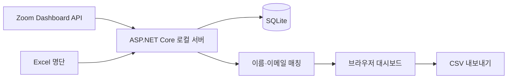

# ZoomCheck

Windows에서 Excel 명단과 진행 중인 Zoom 회의 참가자를 공식 API로 대조하는 로컬 웹 대시보드입니다.

[English](README.md) · [Windows 실회의 테스트](docs/windows-live-test-ko.md) · [MIT License](LICENSE)

[](https://github.com/ianlyoo/zoomcheck/actions/workflows/ci.yml)
[](https://github.com/ianlyoo/zoomcheck/actions/workflows/build-windows-installer.yml)
[](https://github.com/ianlyoo/zoomcheck/releases/latest)

Zoom 참가자 패널을 화면 인식하거나 UI Automation으로 읽지 않습니다. 공식 Zoom Dashboard API를 주기적으로 조회하고, Excel 명단과 매칭해 관측된 입장·퇴장 변화를 SQLite에 저장합니다.

## 주요 기능

- 브라우저에서 Excel `.xlsx`/`.xls` 직접 업로드
- Zoom 현재 참가자 즉시 조회 및 5~600초 자동 동기화
- 이메일 우선 매칭, 이름·별칭 매칭, 검토 필요/미매칭 분리
- SQLite 기반 입장·퇴장 액티브 로그와 현재 참석 상태
- CSV 내보내기와 API 장애 시 전체 참가자 목록 수동 붙여넣기
- 별도 .NET 설치가 필요 없는 Windows 설치 파일과 portable ZIP
- `http://127.0.0.1:5078`에만 바인딩되는 로컬 웹 대시보드

## Zoom API 준비

공동호스트 권한만으로는 API 권한이 생기지 않습니다. 회의가 속한 Zoom 계정의 소유자/관리자가 Zoom Marketplace에서 Server-to-Server OAuth 앱을 만들고 활성화해야 합니다.

- 최신 granular scope: `dashboard:read:list_meeting_participants:admin`
- 기존 classic scope: `dashboard_meetings:read:admin`
- Zoom Dashboard API 접근이 포함된 계정 권한도 필요합니다. 실제 권한이 부족하면 대시보드가 403 원인을 표시합니다.

Windows PowerShell에서 자격증명을 현재 사용자 환경 변수로 한 번 저장한 뒤 ZoomCheck를 완전히 종료하고 다시 실행합니다.

```powershell
[Environment]::SetEnvironmentVariable("ZOOMCHECK_Zoom__AccountId", "여기에_ACCOUNT_ID", "User")
[Environment]::SetEnvironmentVariable("ZOOMCHECK_Zoom__ClientId", "여기에_CLIENT_ID", "User")
[Environment]::SetEnvironmentVariable("ZOOMCHECK_Zoom__ClientSecret", "여기에_CLIENT_SECRET", "User")
```

이 값은 GitHub, ZIP, `appsettings.json`에 넣지 마세요. 설치 파일과 portable ZIP은 OAuth 값, DB, Excel, CSV, 로그를 포함하지 않도록 빌드 단계에서 검사합니다.

## 회의 중 사용 순서

1. ZoomCheck를 실행하고 실제 회의 ID를 입력합니다.
2. 번호·성명 열이 있는 Excel 명단을 올립니다.
3. **지금 참가자 불러오기**를 눌러 현재 인원과 첫 입장 로그를 확인합니다.
4. **실시간 자동 동기화**를 켭니다. 기본 10초를 권장합니다.
5. 현재 참석, 미참석, 검토 필요, 미매칭 Zoom 이름, 입·퇴장 로그를 확인합니다.
6. 회의가 실제로 0명이 되었을 때만 **이번 1회 0명 응답 허용**을 체크하고 다시 동기화해 전원 퇴장을 확정합니다.
7. 회의가 끝나면 CSV를 내려받습니다.

액티브 로그 시각은 실제 Zoom 이벤트 시각이 아니라 API 폴링에서 변화를 관측한 시각입니다. 따라서 최대 한 폴링 간격과 Zoom API 반영 시간만큼 늦을 수 있습니다. API 오류, 불완전한 pagination, 확인되지 않은 빈 응답은 기존 출석 상태를 전원 퇴장으로 덮어쓰지 않습니다.

Windows 데이터베이스는 `%LOCALAPPDATA%\ZoomCheck\data\zoomcheck.db`에 저장됩니다.

## 구조



실시간 조회는 `GET /v2/metrics/meetings/{meetingId}/participants?type=live`를 사용합니다. pagination을 모두 따라가고, 짧은 `429 Retry-After`는 한 번 재시도하며, `status=in_meeting`인 참가자만 현재 참석으로 반영합니다.

## 소스에서 실행

```bash
dotnet restore ZoomCheck.sln
dotnet test ZoomCheck.sln -c Release
dotnet run --project src/ZoomCheck.Backend
```

Windows 패키지 출력:

- `dist\installer\ZoomCheck-Setup-x64.exe`
- `dist\portable\ZoomCheck-portable-win-x64.zip`

## 주의

출석 정보는 민감한 데이터입니다. 공식 기록으로 사용하기 전에 검토 필요 항목과 CSV 결과를 사람이 확인하세요.

## 라이선스

MIT — [LICENSE](LICENSE)를 참조하세요.
