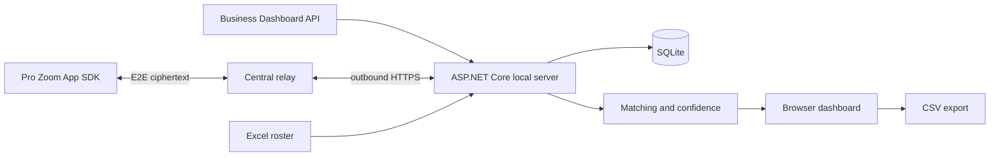

# ZoomCheck

Windows web dashboard that compares an Excel roster with a live Zoom meeting through either the Business Dashboard API or an in-meeting Zoom App bridge suitable for Pro accounts.

[한국어](README.ko.md) · [Operator guide](docs/windows-operator-guide.md) · [MIT License](LICENSE)

[](https://github.com/ianlyoo/zoomcheck/actions/workflows/ci.yml)
[](https://github.com/ianlyoo/zoomcheck/actions/workflows/build-windows-installer.yml)
[](https://github.com/ianlyoo/zoomcheck/releases/latest)

ZoomCheck does not scrape the participant panel or automate Zoom UI. Business accounts can use the Dashboard API; Pro deployments can use the official Zoom Apps SDK from a host/co-host's in-meeting app. Both feed the same local matching and attendance engine.

## Features

- Excel `.xlsx`/`.xls` upload from the browser
- Roster group columns (`조`, `분반`, `그룹`, `팀`, `반`) with scoped totals, search, and CSV export
- Live Zoom participant sync, manual refresh, and 5–600 second auto-sync
- Email-first matching plus name, alias, and review confidence levels
- Persistent join/leave activity log and current attendance state
- Expandable participant rows with phone, group, raw/canonical Zoom names, and connection history
- Safe Korean name canonicalization, rename activity, and duplicate connection groups
- Explicit host/co-host action to apply a uniquely confirmed canonical name in the live Zoom meeting
- CSV export, manual full-list fallback, responsive local dashboard
- Self-contained Windows installer and portable ZIP; no separate .NET install
- Startup update checks and verified downloads with one-click install/restart in the dashboard
- Six-step first-run guide with skip and reopen controls
- Light and dark themes with Windows preference sync and saved overrides
- Local-only listener at `http://127.0.0.1:5078`; data under `%LOCALAPPDATA%\ZoomCheck`
- Auto, Business API, Pro Zoom App, and manual connection modes

## Business Dashboard API

A co-host role by itself does **not** grant API access. A Zoom account owner or admin must create and activate a Server-to-Server OAuth app for the account that owns the meeting. Add the granular scope `dashboard:read:list_meeting_participants:admin`; classic apps use `dashboard_meetings:read:admin`. The account must also have access to the Zoom Dashboard API.

Set these as Windows user environment variables, then restart ZoomCheck:

```powershell
[Environment]::SetEnvironmentVariable("ZOOMCHECK_Zoom__AccountId", "YOUR_ACCOUNT_ID", "User")
[Environment]::SetEnvironmentVariable("ZOOMCHECK_Zoom__ClientId", "YOUR_CLIENT_ID", "User")
[Environment]::SetEnvironmentVariable("ZOOMCHECK_Zoom__ClientSecret", "YOUR_CLIENT_SECRET", "User")
```

Credentials are never bundled in source, the installer, or the portable archive.

## Pro Zoom App bridge

Fork this repository and deploy `render.yaml` to **your own Render account**, or deploy `src/ZoomCheck.Relay` to an HTTPS server you control. Public source and GitHub Releases intentionally contain no maintainer-specific relay URL. Configure the Zoom General App Home/Redirect/Allow List as `https://YOUR-RELAY/zoom-app/`, then set that base URL on each Windows PC. The relay holds only ciphertext, public keys, and short-lived in-memory sessions; P-256 ECDH + HKDF-SHA256 derives directional AES-256-GCM keys that the relay never receives.

```powershell
[Environment]::SetEnvironmentVariable("ZOOMCHECK_ZoomRelay__BaseUrl", "https://YOUR-RELAY/", "User")
```

Restart ZoomCheck after setting the variable. Public installers keep `ZoomRelay.BaseUrl` blank. An internal custom build may use `build-installer.ps1 -RelayBaseUrl https://YOUR-RELAY/`, but do not publish that artifact if the URL must remain private. Enable `getSupportedJsApis`, `getMeetingContext`, `getMeetingUUID`, `getUserContext`, `getMeetingParticipants`, `onParticipantChange`, and `setParticipantScreenName` in the Zoom App SDK capabilities. The last capability is optional for attendance but required for changing a participant's live display name.

ZoomCheck checks the runtime role and available APIs instead of assuming the co-host's subscription. The in-meeting user must actually be host/co-host before opening the app and the client must expose `getMeetingParticipants`. The account running the companion must install/approve the app; cross-account or cross-organization testing may require internal distribution or Marketplace test access. Create a new six-digit code for every meeting and after an app reload. The code is single-use and expires after ten minutes.

End users install/approve ZoomCheck once. Per meeting they upload Excel, become host/co-host, create a six-digit code, and enter it in Apps → ZoomCheck. The code is single-use, expires after ten minutes, and is rendezvous-only—not an encryption key. Participant UUID, display name, and meeting role stay end-to-end encrypted and are stored only by the local Windows app. The existing direct HTTPS bridge (`ZOOMCHECK_ZoomApp__HomeUrl`) and Business Dashboard API remain available as fallback modes.

The Zoom Apps SDK does not expose other participants' camera on/off state to this app, so ZoomCheck deliberately does not display an inferred per-participant video status.

## Use during a meeting

1. Install and launch ZoomCheck; the local dashboard opens in the default browser.
2. Enter the live meeting ID and upload an Excel roster containing number/name columns.
3. Select **Sync Zoom participants now** and verify the current count.
4. Enable automatic sync; 10 seconds is the recommended default.
5. Select a participant row to inspect raw Zoom names, safe canonicalization, connections, and attendance history.
6. Review ambiguous, duplicate, or unmatched names, then export CSV at the end.
7. In Business mode, confirm a true zero-participant response from the warning bar. The Pro Zoom App bridge confirms two consecutive empty snapshots automatically.

Times in the activity log are polling observation times and may lag Zoom by one polling interval. API errors, incomplete pagination, and unconfirmed empty responses leave the previous attendance snapshot unchanged.

## Architecture



| Project | Responsibility |
|---|---|
| `src/ZoomCheck.Core` | Domain models and participant matching |
| `src/ZoomCheck.Infrastructure` | Excel parsing, SQLite persistence, attendance projection |
| `src/ZoomCheck.Backend` | Zoom OAuth/API client, controllers, and local web dashboard |
| `src/ZoomCheck.Relay` | Stateless ciphertext relay and Zoom companion |

The live endpoint is `GET /v2/metrics/meetings/{meetingId}/participants?type=live`. ZoomCheck follows pagination, retries one short `429 Retry-After`, and accepts only participants whose status is `in_meeting`.

## Development

```bash
dotnet restore ZoomCheck.sln
dotnet test ZoomCheck.sln -c Release
dotnet run --project src/ZoomCheck.Backend
```

Build Windows artifacts from PowerShell with .NET 8 SDK and Inno Setup 6:

```powershell
.\deploy\windows\build-installer.ps1 -Configuration Release -Runtime win-x64
```

Outputs:

- `dist\installer\ZoomCheck-Setup-x64.exe`
- `dist\installer\SHA256SUMS.txt`
- `dist\portable\ZoomCheck-portable-win-x64.zip`

## App updates

The installed Windows app checks GitHub Releases at startup and periodically afterwards. When a newer version exists, it downloads only `ZoomCheck-Setup-x64.exe` and `SHA256SUMS.txt` and prepares the installer only after its SHA-256 matches. It never closes an active meeting without an explicit action: use the footer version indicator or **Windows app update** in Settings, then select **Install and restart**.

Update assets contain no operator-specific Render URL, Zoom app ID, OAuth URL, or credentials. The existing per-user `ZOOMCHECK_ZoomRelay__BaseUrl` environment variable remains in place across updates. The portable ZIP is not self-installing, so the installer build is recommended for automatic updates.

## Responsible use

Attendance data is sensitive. Verify ambiguous matches and the exported CSV before using it as an official record. ZoomCheck stores its database locally and does not guarantee attendance accuracy.

## License

MIT — see [LICENSE](LICENSE).
