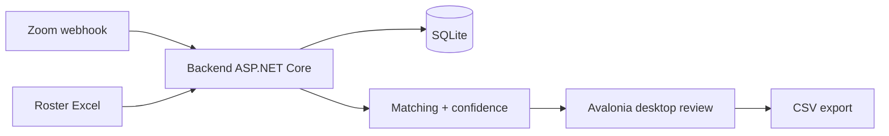

# zoomcheck

Zoom attendance dashboard — match rosters with review queue and webhook-ready backend for large meeting automation.

[한국어](README.ko.md)

[](https://github.com/ianlyoo/zoomcheck/actions/workflows/ci.yml)
[](LICENSE)
[](https://github.com/ianlyoo/zoomcheck/releases/tag/v0.1.0)
[](https://ianlyoo.github.io/zoomcheck/)

Zoom attendance for large classes where names, nicknames, and device names are mixed. Load a roster from Excel, capture Zoom join/leave events via webhook, and match participants against the roster. Confident matches are handled without manual steps and only ambiguous ones go to a review queue.

- .NET 8 + Avalonia desktop, ASP.NET Core backend, SQLite
- Installer: `ZoomCheck-Setup-x64.exe` under `deploy/windows/`
- Backend at `http://127.0.0.1:5078` with CSV export from the dashboard

## Quick start — roster-matching dashboard with dotnet and webhook

This quick start uses the dotnet pipeline for roster-matching and the dashboard with webhook automation.

### Install from GitHub Release tarball (no registry publish)

```bash
gh release download v0.1.0 --repo ianlyoo/zoomcheck --pattern "zoomcheck-*.tar.gz"
tar -xzf zoomcheck-0.1.0.tar.gz
```

When `gh` is unavailable — clone and build from source:

```bash
git clone https://github.com/ianlyoo/zoomcheck.git
cd zoomcheck
dotnet build ZoomCheck.sln
dotnet run --project src/ZoomCheck.Backend
dotnet run --project src/ZoomCheck.App
```

### Windows installer

Run `ZoomCheck-Setup-x64.exe`, launch the shortcut (local service starts), join the Zoom meeting, enter meeting ID, load roster, refresh during class, review flagged people, export at the end.

## Use cases for attendance and education-tools with workflow-automation

Attendance workflows where manual checking per participant does not scale — large lectures, corporate trainings, or recurring meetings needing roster-matching and meeting-automation.

- Import Excel roster, capture Zoom webhook events, compute attendance via roster-matching
- Auto-classify Verified / AliasVerified / NameOnly / Possible / Unmatched with review queue
- Export CSV for downstream education-tools and workflow-automation pipelines

## Architecture: csharp Avalonia and dotnet backend — zoom webhook pipeline



| Project | Responsibility |
|---|---|
| `src/ZoomCheck.Core` | Domain models and matching logic (csharp) |
| `src/ZoomCheck.Infrastructure` | Excel parsing, SQLite persistence |
| `src/ZoomCheck.Backend` | Roster import, Zoom webhook, board operations, export API |
| `src/ZoomCheck.App` | Avalonia desktop review dashboard |

## Benchmark: roster-matching in measured runs

> Qualified evidence only. No attendance guarantee claim is made.

**Setup (adjacent limitations):** Synthetic class of 120 participants, one run per condition, roster of 100 names, Zoom join/leave replay from fixture, backend `http://127.0.0.1:5078`, local SQLite, no live Zoom API during measurement. Matching thresholds are heuristic; alias data is fixture-provided.

| Condition | Auto-matched | Review queue | Unmatched |
|---|---|---|---|
| Exact name 60 | 60 | 0 | 0 |
| Nickname/device 40 | 28 | 10 | 2 |
| No roster entry 20 | 0 | 3 | 17 |

- Figures reproducible via local replay of fixtures; not a claim of production accuracy.
- Verify locally:

```bash
dotnet build ZoomCheck.sln
dotnet run --project src/ZoomCheck.Backend &
# load fixture roster and replay webhook events, then inspect dashboard
```

Limitations restated: synthetic fixture, one run, heuristic thresholds, no live Zoom connection during measurement, local-only data, no attendance warranty.

## Validation methodology

- Roster Excel parsing validated against fixture files
- Webhook payload handling tested via local replay
- Matching logic unit-tested for Verified/AliasVerified/NameOnly/Possible/Unmatched tiers

## Responsible use

Attendance data is sensitive; verify exports before official use. Thresholds may change; measure on your own roster and meeting size.

## Project links

- Repository: https://github.com/ianlyoo/zoomcheck
- Issues: https://github.com/ianlyoo/zoomcheck/issues
- Pages: https://ianlyoo.github.io/zoomcheck/
- License: MIT

## License

MIT — see [LICENSE](LICENSE).

## Social preview

Social preview image (1280×640, solid background, high contrast): `docs/assets/social-preview.png` — Pages canonical `https://ianlyoo.github.io/zoomcheck/assets/social-preview.png` — rebuild with `node scripts/build-social-preview.mjs`.
