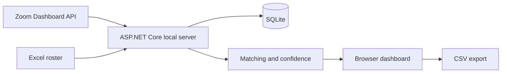

# ZoomCheck

Windows local web dashboard that compares an Excel roster with participants in a live Zoom meeting through the official Zoom Dashboard API.

[한국어](README.ko.md) · [Operator guide](docs/windows-operator-guide.md) · [MIT License](LICENSE)

[](https://github.com/ianlyoo/zoomcheck/actions/workflows/ci.yml)
[](https://github.com/ianlyoo/zoomcheck/actions/workflows/build-windows-installer.yml)
[](https://github.com/ianlyoo/zoomcheck/releases/latest)

ZoomCheck does not read the Zoom participant panel, use screen recognition, or automate the Zoom desktop UI. It polls the official API, matches participants to the roster, records observed join/leave changes in SQLite, and keeps ambiguous names in a review queue.

## Features

- Excel `.xlsx`/`.xls` upload from the browser
- Live Zoom participant sync, manual refresh, and 5–600 second auto-sync
- Email-first matching plus name, alias, and review confidence levels
- Persistent join/leave activity log and current attendance state
- CSV export, manual full-list fallback, responsive local dashboard
- Self-contained Windows installer and portable ZIP; no separate .NET install
- Local-only listener at `http://127.0.0.1:5078`; data under `%LOCALAPPDATA%\ZoomCheck`

## Zoom API requirement

A co-host role by itself does **not** grant API access. A Zoom account owner or admin must create and activate a Server-to-Server OAuth app for the account that owns the meeting. Add the granular scope `dashboard:read:list_meeting_participants:admin`; classic apps use `dashboard_meetings:read:admin`. The account must also have access to the Zoom Dashboard API.

Set these as Windows user environment variables, then restart ZoomCheck:

```powershell
[Environment]::SetEnvironmentVariable("ZOOMCHECK_Zoom__AccountId", "YOUR_ACCOUNT_ID", "User")
[Environment]::SetEnvironmentVariable("ZOOMCHECK_Zoom__ClientId", "YOUR_CLIENT_ID", "User")
[Environment]::SetEnvironmentVariable("ZOOMCHECK_Zoom__ClientSecret", "YOUR_CLIENT_SECRET", "User")
```

Credentials are never bundled in source, the installer, or the portable archive.

## Use during a meeting

1. Install and launch ZoomCheck; the local dashboard opens in the default browser.
2. Enter the live meeting ID and upload an Excel roster containing number/name columns.
3. Select **Sync Zoom participants now** and verify the current count.
4. Enable automatic sync; 10 seconds is the recommended default.
5. Review ambiguous or unmatched names, then export CSV at the end.
6. If the meeting has truly reached zero participants, explicitly allow one empty API snapshot to record everyone as left.

Times in the activity log are polling observation times and may lag Zoom by one polling interval. API errors, incomplete pagination, and unconfirmed empty responses leave the previous attendance snapshot unchanged.

## Architecture



| Project | Responsibility |
|---|---|
| `src/ZoomCheck.Core` | Domain models and participant matching |
| `src/ZoomCheck.Infrastructure` | Excel parsing, SQLite persistence, attendance projection |
| `src/ZoomCheck.Backend` | Zoom OAuth/API client, controllers, and local web dashboard |

The live endpoint is `GET /v2/metrics/meetings/{meetingId}/participants?type=live`. ZoomCheck follows pagination, retries one short `429 Retry-After`, and accepts only participants whose status is `in_meeting`.

## Development

```bash
dotnet restore ZoomCheck.sln
dotnet test ZoomCheck.sln -c Release
dotnet run --project src/ZoomCheck.Backend
```

Build Windows artifacts from PowerShell with .NET 8 SDK and Inno Setup 6:

```powershell
.\deploy\windows\build-installer.ps1 -Configuration Release -Runtime win-x64
```

Outputs:

- `dist\installer\ZoomCheck-Setup-x64.exe`
- `dist\portable\ZoomCheck-portable-win-x64.zip`

## Responsible use

Attendance data is sensitive. Verify ambiguous matches and the exported CSV before using it as an official record. ZoomCheck stores its database locally and does not guarantee attendance accuracy.

## License

MIT — see [LICENSE](LICENSE).
