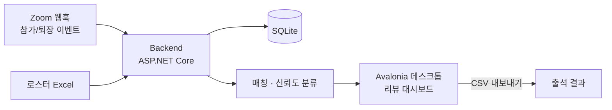

# ZoomCheck

> 수업·교육용 Zoom 출석 체크 대시보드 (Windows 중심)

[English](README.en.md) · [MIT License](LICENSE) · .NET 8 · Avalonia · 

Excel 로스터를 불러오고 Zoom 참가 이벤트를 받아, 참가자와 로스터를 매칭해 출석을
집계한다. 이름·별명·기기명이 뒤섞인 실제 수업에서 모든 참가자를 일일이 확인하는 건
비현실적이다.

**ZoomCheck는 확실한 매칭은 자동으로 처리하고, 애매한 경우만 리뷰 큐로 보낸다.**
운영자는 대부분을 무시하고 검토가 필요한 소수에만 집중하면 된다.

## 아키텍처



## 빠른 시작 (설치 프로그램)

1. `ZoomCheck-Setup-x64.exe` 실행 → 설치 마법사 완료
2. **ZoomCheck** 바로가기 실행 (로컬 서비스가 자동 기동)
3. Zoom 회의 열기/참여
4. 회의 ID 입력 → 로스터 로드 → 수업 중 Refresh → 표시된 인원 검토 → 종료 시 내보내기

설치 아티팩트는 `deploy/windows/` 아래에 있다.

## 구성

4개 프로젝트로 나뉜다.

| 프로젝트 | 역할 |
|---|---|
| `src/ZoomCheck.Core` | 도메인 모델과 매칭 로직 |
| `src/ZoomCheck.Infrastructure` | Excel 파싱과 SQLite 영속화 |
| `src/ZoomCheck.Backend` | 로스터 임포트·Zoom 웹훅·보드 프로젝션·내보내기 API |
| `src/ZoomCheck.App` | 운영자 대시보드 (Avalonia 데스크톱) |

## 매칭 신뢰도

| 등급 | 의미 |
|---|---|
| `Verified` | 가장 강한 매칭, 주로 이메일 기반 |
| `AliasVerified` | 운영자가 이전에 이 Zoom 이름을 확인함 |
| `NameOnly` | 이름은 일치하나 빠른 확인 권장 |
| `Possible` | 약한 후보, 검토 권장 |
| `Unmatched` | 안전한 로스터 매칭 없음 |

## API

소스에서 실행 시 백엔드는 `http://0.0.0.0:5078`에 뜨고, 데스크톱 앱은 `http://127.0.0.1:5078/`를 바라본다.

| 엔드포인트 | 설명 |
|---|---|
| `GET /health`, `GET /api/zoom/settings-status` | 상태·설정 확인 |
| `POST /api/roster/import`, `GET /api/roster`, `POST /api/roster/alias` | 로스터 |
| `POST /api/zoom/webhooks/events` · `participant-event` · `raw` | Zoom 이벤트 |
| `GET /api/zoom/recovery/last`, `POST /api/zoom/recovery/run` | 지각 시작 복구 |
| `GET /api/meetings/{meetingId}/board` | 실시간 보드 |
| `POST /api/meetings/{meetingId}/seed-demo` | 데모 이벤트 시드 |
| `GET /api/meetings/{meetingId}/export` | 출석 CSV 내보내기 |

## 설정 레퍼런스

`src/ZoomCheck.Backend/appsettings.json` 또는 환경변수로 설정한다.

```json
"Zoom": {
  "WebhookSecretToken": "...",
  "ClientId": "...",
  "ClientSecret": "...",
  "AccountId": "...",
  "RequestTimestampToleranceSeconds": 300
}
```

이 값들은 웹훅 서명 검증, `endpoint.url_validation` 챌린지 처리, S2S OAuth 토큰 획득·캐싱,
`/api/zoom/settings-status` 상태 확인을 활성화한다.

데이터는 SQLite에 저장된다 (기본 `data/zoomcheck.db`): 로스터 항목, 별칭 매핑, 참가자 이벤트 로그.

## 지각 시작 복구

백엔드가 회의 시작 후에 뜨면 Zoom은 이전 참가 이벤트를 재전송하지 않는다. 이 공백을 복구 경로로 메운다.

- `appsettings.json`의 `ZoomRecovery`로 설정: `Enabled`, `StartupDelaySeconds`,
  `PeriodicScanIntervalSeconds`(`0`이면 주기 스캔 없음), `HostUserIds`,
  `EnableAccountWideUserDiscovery`, `IncludeFallbackMeUser` 등.
- Zoom `GET /users/{userId}/meetings?type=live`로 라이브 회의를 발견하고,
  `GET /metrics/meetings/{meetingId}/participants?type=live`로 누락된 `joined` 이벤트를
  `source = zoom-live-recovery`로 삽입한다.
- `POST /api/zoom/recovery/run`으로 수동 실행, `GET /api/zoom/recovery/last`로 마지막 실행 요약 조회.

## 알려진 한계

- 데스크톱 UI는 자동 갱신/푸시가 아니라 **수동 Refresh**다. 백엔드는 이벤트 기반이지만 화면은 아니다.
- 회의 종료 후 실제 Zoom 재조정(reconciliation)은 아직 미구현.
- 패키징 설치 프로그램은 준비됐으나 최종 `setup.exe`는 Windows에서 빌드해야 한다.

## 개발

소스에서 실행:

```bash
dotnet run --project src/ZoomCheck.Backend/ZoomCheck.Backend.csproj --urls http://0.0.0.0:5078
dotnet run --project src/ZoomCheck.App/ZoomCheck.App.csproj
```

Windows 설치 프로그램 빌드 (.NET 8 SDK + Inno Setup 6):

```powershell
powershell -ExecutionPolicy Bypass -File .\deploy\windows\build-installer.ps1
```

산출물: `dist\installer\ZoomCheck-Setup-x64.exe`. GitHub Actions
`.github/workflows/build-windows-installer.yml`로도 빌드할 수 있다. 운영자 가이드는
`docs/windows-operator-guide.md`.

## License

[MIT](LICENSE) © 2026 AhnRyu
